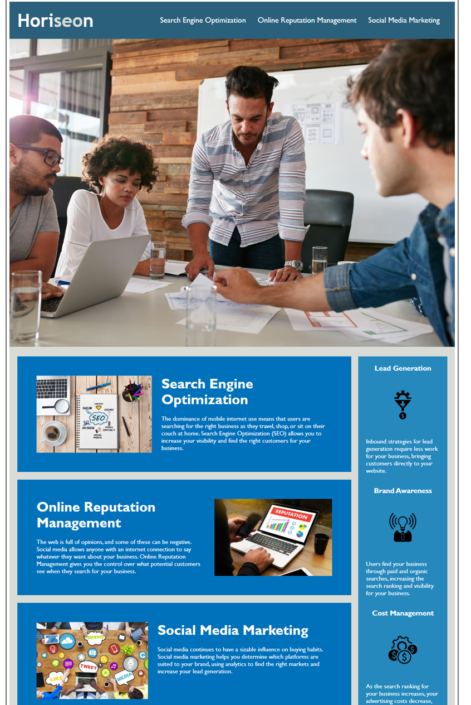

# Model-2-challenge-Portfolio

## Description

Created a Portfolio for homework

mocking from model 2 challenge 

## Installation

VS Code 

Git Bash 

## Usage

AS A marketing agency
I WANT a codebase that follows accessibility standards
SO THAT our own site is optimized for search engines

## License

🏆

## How to Contribute

If you created an application or package and would like other developers to contribute it, you can include guidelines for how to do so. The [Contributor Covenant](https://www.contributor-covenant.org/) is an industry standard, but you can always write your own if you'd prefer.

